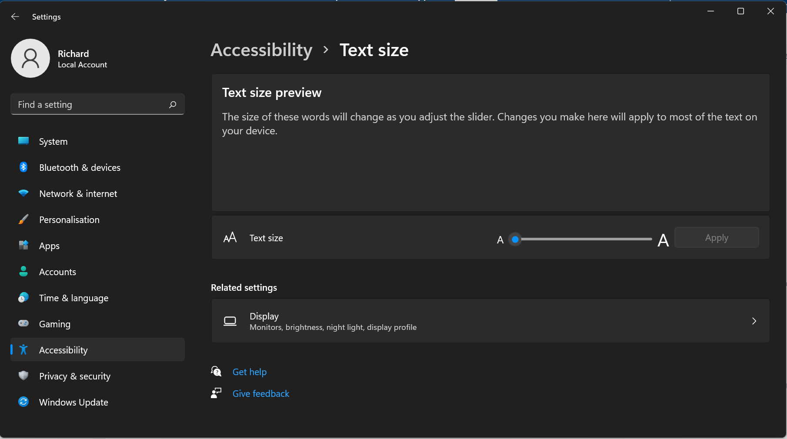
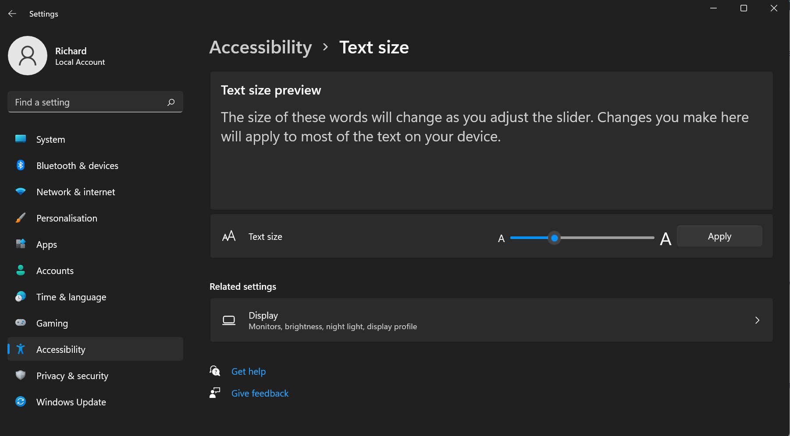

## Steps to reproduce

1. `npm i`
2. `npm start`
3. Make sure system text size is not set i.e.
4. 
5. Press the animate button several times.
6. Observe that animation is correct.
7. Set system text size i.e.
8. 
9. Press the animate button several times.
10. See that window escapes the screen
